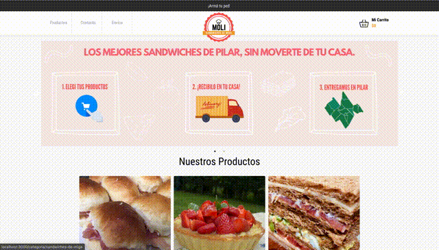

# E-COMMERCE Sandwicheria

Este proyecto fue construido para el curso de ReactJS de CoderHouse, utilizando 'create-react-app' y 'react-router-dom' para manejar las rutas. Los estilos se estan manejaron puramente con CSS. 
Para mejorar la organización, el proyecto se encuentra estructurado en: Components, Containers y Pages. 

Las funcionalidades actuales son: 
- Listar Categorías
- Listar Productos de una Categoría
- Listar Todos los Productos
- Ver detalles de un producto
- Agregar/Eliminar/Editar Productos al Carrito
- Crear un Pedido
- Consultar Estado de un Pedido **(New)**
- Formulario de Contacto

Para mejorar la experiencia del usuario se usaron las siguientes librerias:
- **react-slick:** para crear un slider en la home-page que muestre información relevante que el usuario, envios, ofertas, etc.
- **typewriter-effect:** es una librería muy liviana (56k) que da un efecto de tipeo a mano de escribir a los mensajes que mostramos en la TOP bar.
- **react-stepper-horizontal:** es una libreria que permite implementar muy simple un stepper para mostrar el Estado del Pedido. Si bien con la funcionalidad actual solo permite realizar hasta la creación del pedido, en futuras versiones se implementara un backend que permite cambiar el estado del Pedido (Recibido, En Preparación, En Delivery, Entregado). 
- En cuanto a la base de datos se implemento Firebase y se esta utilizando la correspondiente libreria **firebase**. 

A continuación una demo de la navegabilidad con la funcionalidad actual: 

Para instalar este proyecto en local, ejecutar las siguientes instrucciones:
1. Clonar el Proyecto:
### `git clone https://github.com/degma/moli.git"`
2. Instalar las dependencias:
### `yarn install`
3. Ejecutar la aplicación en local:
### `yarn start`

